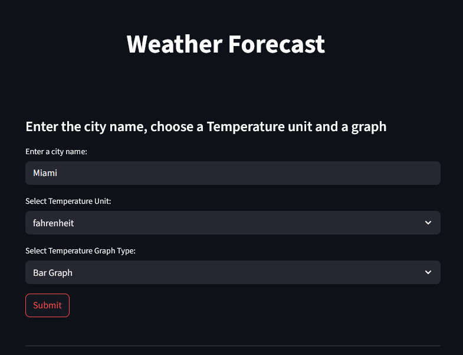
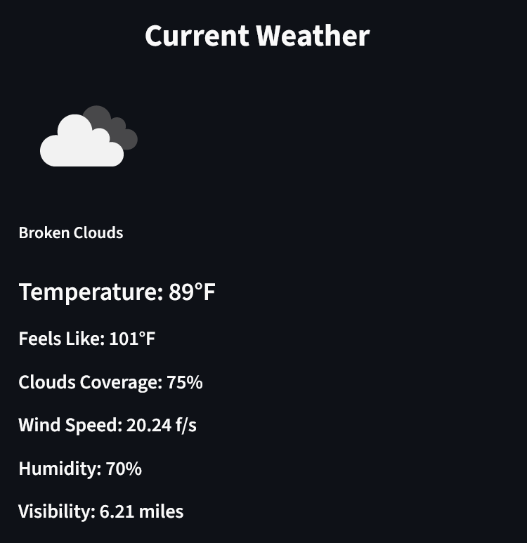
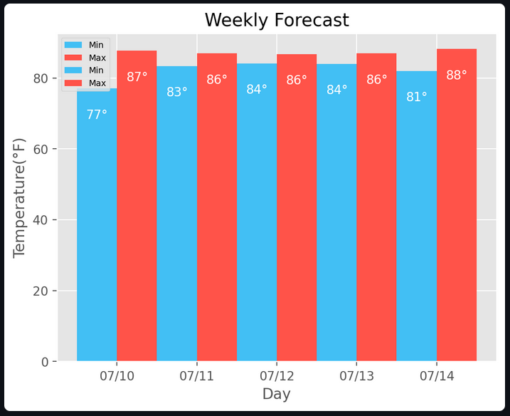
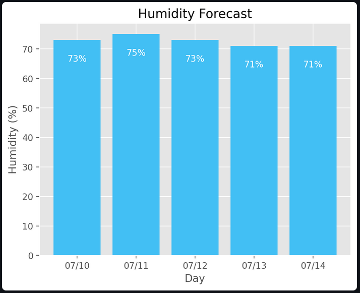

<h1 align="center"> Weather App </h1>

  A clean, interactive weather forecast web app built with <b>Streamlit</b>, using the <b>OpenWeatherMap API</b>.

---

   
   
   
   
   
  

---

## Tech Used

- [Python 3](https://www.python.org/)
- [Streamlit](https://streamlit.io/)
- [PyOWM (OpenWeatherMap)](https://pyowm.readthedocs.io/)
- [Matplotlib](https://matplotlib.org/)
- [Plotly](https://plotly.com/python/)
- [Pandas](https://pandas.pydata.org/)
- [NumPy](https://numpy.org/)

